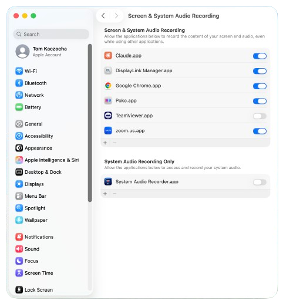
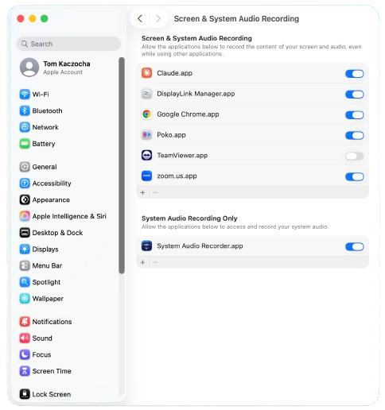
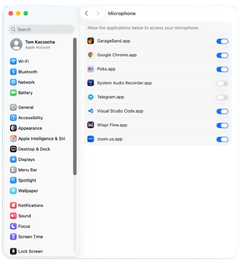
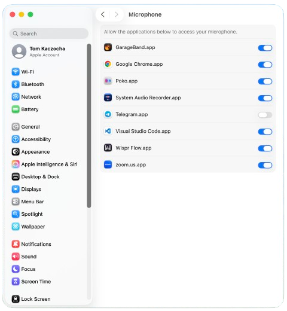
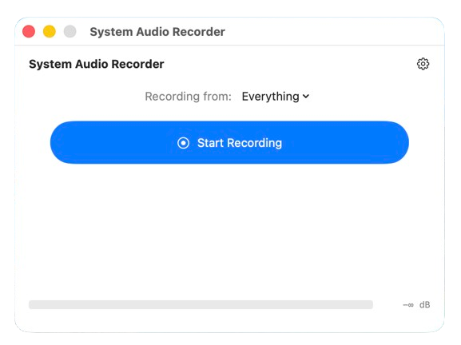
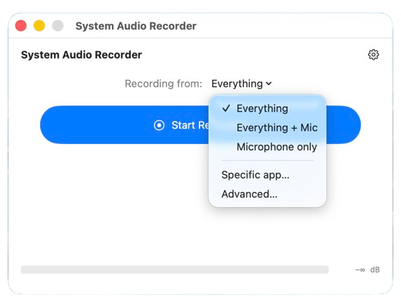
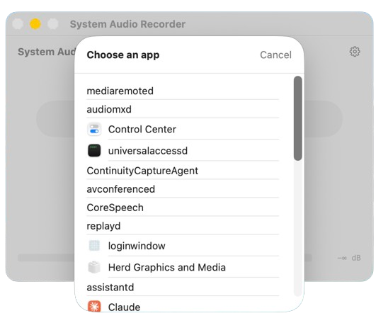
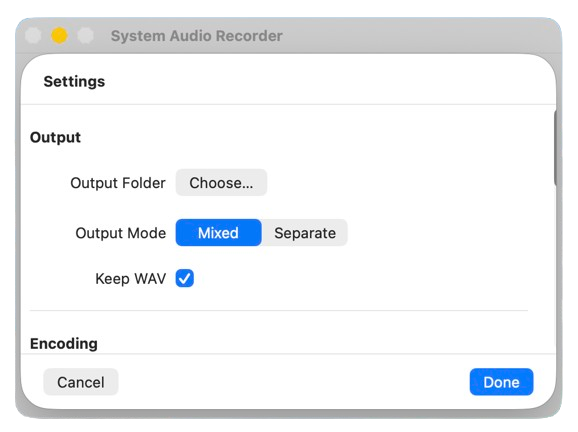
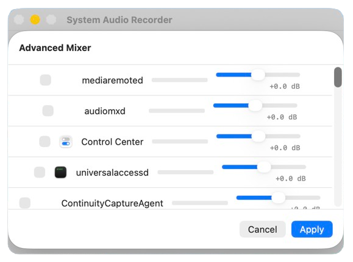

# System Audio Recorder — User Guide

## 1. What this app does

System Audio Recorder captures whatever is playing through your Mac's speakers — music, video, calls, browser tabs — and saves it as an MP3 file. It does this without any virtual audio device or extra software. You can optionally record your microphone alongside the system audio. When you stop, the recording is saved automatically.

---

## 2. Requirements

- **macOS 14.4 Sonoma or later**
- Two privacy permissions (granted once, remembered by macOS):
  - **Screen & System Audio Recording** — required to tap system audio
  - **Microphone** — required only if you want to record your mic
- A few MB of free disk space per minute of audio (MP3 at default quality is very compact)

---

## 3. Install

1. Open the downloaded DMG and drag **System Audio Recorder.app** into your **Applications** folder.
2. Eject the DMG.
3. Double-click the app in Applications to launch it.

> **First-launch Gatekeeper note:** The app is notarized by Apple, so you should not see an "unidentified developer" warning. If macOS blocks the launch anyway (this can happen on certain security configurations), right-click the app icon, choose **Open**, then click **Open** in the dialog. You only need to do this once.

---

## 4. First-launch permissions

The first time the app tries to record, macOS will ask you to grant two permissions. You can also grant them ahead of time in System Settings.

### System Audio Recording

This permission is required. Without it, the app cannot hear your system audio and the **Start Recording** button will be unavailable.

On macOS 14 (Sonoma) the pane is labelled **Screen Recording**. On macOS 15 (Sequoia) and later it is labelled **Screen & System Audio Recording**.

**Denied state — what you'll see before granting:**

Toggle the switch next to **System Audio Recorder** to turn it on, then quit and relaunch the app.

**Granted state — what you'll see after granting:**

[Open Screen & System Audio Recording in System Settings](x-apple.systempreferences:com.apple.preference.security?Privacy_ScreenCapture)

### Microphone

You only need this permission if you enable mic recording (the **Microphone** toggle in the source picker). If you record system audio only, you can skip this.

**Denied state:**

**Granted state:**

[Open Microphone in System Settings](x-apple.systempreferences:com.apple.preference.security?Privacy_Microphone)

> **Note on hotkeys:** The global record/stop hotkey does **not** require Accessibility permission. The app registers it through a macOS system API that is process-scoped, so it never appears in `Privacy & Security → Accessibility`. You do not need to grant Accessibility access.

---

## 5. Recording your first clip

1. Launch the app. The main window shows a source picker and a **Start Recording** button.

   

2. Choose what to record from the source dropdown:
   - **Everything** — captures all system audio mixed together.
   - **Specific app…** — captures only one app's audio. After selecting this, a picker appears listing every audio-producing app currently running. Choose the one you want.
   - **Microphone** — your Mac's default microphone only.

   

   If you chose **Specific app…**, the app picker opens:

   

3. Click **Start Recording**. The button label changes to **Stop Recording** and the level meters become active.

4. When you are done, click **Stop Recording**. The app encodes the audio to MP3 and saves the file. A brief confirmation appears to let you know the file is ready, with a **Reveal in Finder** button to jump straight to it.

> **If Start Recording is greyed out:** Either no source is selected, or the System Audio Recording permission has not been granted yet. Check step 4 above.

---

## 6. Where MP3s are saved

By default, recordings are saved to **~/Music/Recordings/**. You can change this in **Settings → Output**.

The easiest way to find any recording — regardless of where the output folder is set — is to click **Reveal in Finder** on the confirmation that appears after you stop. It takes you directly to the file, no guessing required.

---

## 7. Recording with the menu-bar item

System Audio Recorder keeps a small icon in the macOS menu bar. You can start and stop recordings from the menu-bar item without bringing the main window to the front. This is handy if you keep the app running in the background with the main window hidden.

---

## 8. Hotkey

You can assign a global keyboard shortcut to start and stop recording without switching apps. Open **Settings → Hotkey** inside the app and click the shortcut field to record your preferred key combination.

No system-level permission is required for the hotkey to work. If the hotkey does not fire, the most common cause is that another app has already claimed that key combination. Open **Settings → Hotkey** and pick a different combination.

---

## 9. Troubleshooting

### I get no audio in the recording

The most common cause is that **Screen & System Audio Recording** permission has not been granted. Return to [step 4](#4-first-launch-permissions) and make sure the toggle is on for System Audio Recorder, then quit and relaunch the app.

### The Start button is greyed out

Either:
- No recording source is selected — choose a source from the dropdown.
- The System Audio Recording permission is denied — see [step 4](#4-first-launch-permissions).

### My hotkey doesn't fire

Another app has claimed the same shortcut. Open **Settings → Hotkey** in the app and choose a different key combination.

### The app crashed mid-recording

The app preserves partial recordings. On the next launch, you will be offered the option to re-encode the partial file to MP3. Your audio up to the point of the crash is not lost.

### Advanced: per-app volume mixing

If you need to adjust the relative volume of individual apps before recording, open the **Advanced Mixer** panel. It shows a volume fader for each active audio source.

---

## 10. Uninstall

1. Drag **System Audio Recorder.app** from **/Applications** to the Trash.
2. Empty the Trash.

Your recordings in **~/Music/Recordings/** (or whichever output folder you configured) are left behind on purpose — uninstalling the app does not delete your audio files.
